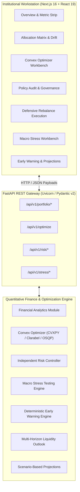
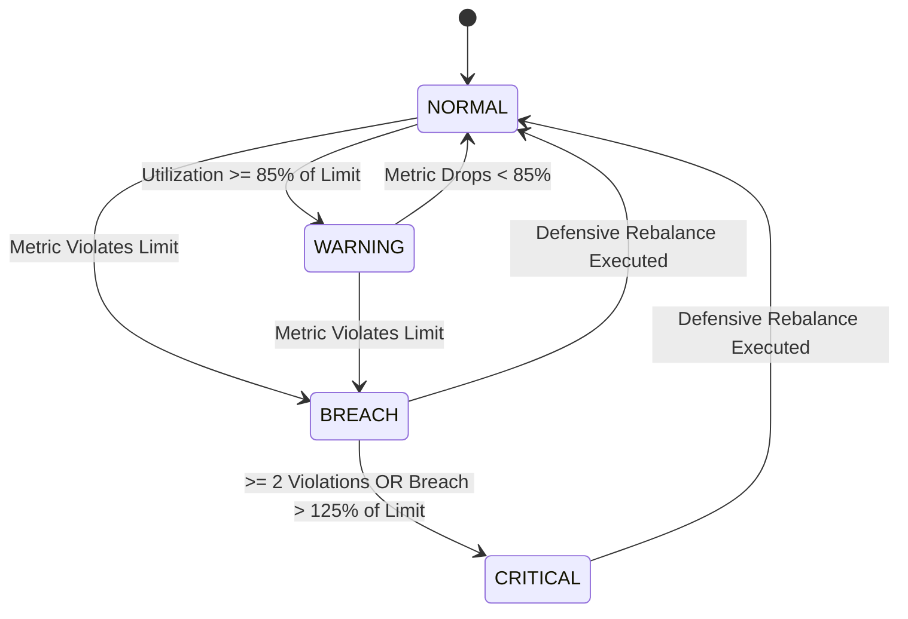
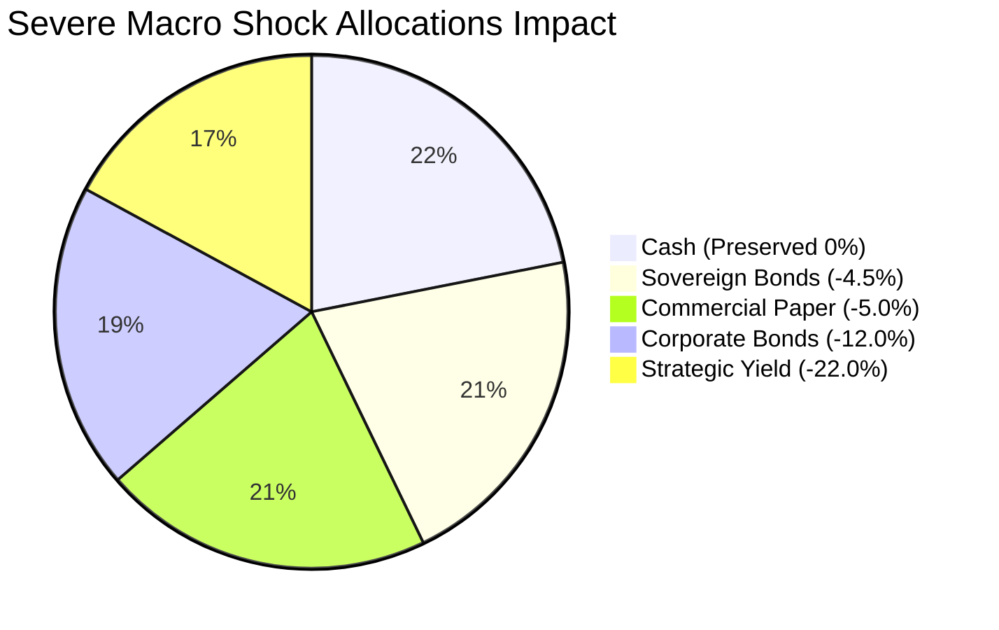

# Jerifin

<div align="center">

### Institutional Capital Allocation & Treasury Risk Platform

**A deterministic, convex, policy-governed decision-support system for corporate treasuries, fund managers, and institutional asset allocators.**

[](https://www.python.org/)
[](https://fastapi.tiangolo.com/)
[](https://nextjs.org/)
[](https://react.dev/)
[](https://www.typescriptlang.org/)
[](https://www.cvxpy.org/)
[](#18-testing-suite--verification)
[](https://www.docker.com/)
[](https://railway.app/)

</div>

> [!IMPORTANT]
> **HACKATHON PROJECT & DEMO DATA DISCLAIMER**  
> Jerifin is an engineering and quantitative research prototype developed for hackathon evaluation. All market return distributions and quote series generated by the platform are **deterministic synthetic simulations** initialized with fixed pseudo-random seeds. They are intended strictly for algorithmic verification, solver benchmarking, and user-interface demonstration. This software does **not** constitute financial, investment, legal, or tax advice.

---

## Table of Contents

1. [Executive Summary](#1-executive-summary)
2. [The Core Problem & Market Gap](#2-the-core-problem--market-gap)
3. [Key Capabilities & Architectural Pillars](#3-key-capabilities--architectural-pillars)
4. [System Architecture & Data Flow](#4-system-architecture--data-flow)
5. [Quantitative Methodology & Formulations](#5-quantitative-methodology--formulations)
6. [Institutional Asset Universes](#6-institutional-asset-universes)
7. [Risk Governance & Policy Control Framework](#7-risk-governance--policy-control-framework)
8. [Automated Defensive Rebalancing](#8-automated-defensive-rebalancing)
9. [Macroeconomic Stress Testing Engine](#9-macroeconomic-stress-testing-engine)
10. [Early Warning & Proactive Decision Support](#10-early-warning--proactive-decision-support)
11. [Multi-Horizon Liquidity Outlook Engine](#11-multi-horizon-liquidity-outlook-engine)
12. [Scenario-Based Portfolio Projections](#12-scenario-based-portfolio-projections)
13. [Repository Structure](#13-repository-structure)
14. [FastAPI REST API Reference](#14-fastapi-rest-api-reference)
15. [Frontend Institutional Workstation](#15-frontend-institutional-workstation)
16. [Installation & Local Development](#16-installation--local-development)
17. [Docker & Production Deployment](#17-docker--production-deployment)
18. [Testing Suite & Verification](#18-testing-suite--verification)
19. [Numerical Stability & Infeasibility Handling](#19-numerical-stability--infeasibility-handling)
20. [Security, Integrity & Disclaimers](#20-security-integrity--disclaimers)
21. [Design Choices & Trade-Offs](#21-design-choices--trade-offs)
22. [Platform Roadmap](#22-platform-roadmap)
23. [Project Metadata & Acknowledgments](#23-project-metadata--acknowledgments)

---

## 1. Executive Summary

**Jerifin** is an institutional-grade treasury risk management and convex capital allocation platform. Designed specifically for corporate treasurers, startup finance chiefs, and fund managers managing multi-million or multi-crore cash pools, Jerifin replaces manual spreadsheets and unconstrained heuristics with rigorous, mathematically provable portfolio optimization and defensive risk governance.

At its core, Jerifin treats corporate cash management not as an aggressive alpha-seeking hedge fund, but as a **capital preservation engine with disciplined yield enhancement**. By pairing disciplined **Convex Conic Optimization** ($\text{CVXPY}$ backed by the $\text{Clarabel}$ and $\text{OSQP}$ interior-point solvers) with an **Independent Risk Controller**, the platform guarantees that capital is allocated efficiently while strictly honoring single-instrument concentration ceilings, weighted liquidity floors, historical drawdown limits, and tail risk tolerances ($\text{CVaR}_{95\%}$).

When market conditions deteriorate or allocations drift into danger zones, Jerifin's **Defensive Rebalancer** calculates a minimum-turnover ($L_1$-norm penalized) reallocation plan that brings the portfolio back into compliance with institutional investment policy while minimizing market friction.

---

## 2. The Core Problem & Market Gap

Corporate treasuries across India and global markets manage substantial balance-sheet reserves (from ₹10 Crore to ₹1,000+ Crore, or $10M to $500M+). Despite the sheer scale of capital at risk, institutional cash operations suffer from persistent structural inefficiencies:

| Vulnerability | Industry Status Quo | Jerifin Solution |
| :--- | :--- | :--- |
| **Tooling & Analytics** | Static, error-prone Excel models updated weekly or monthly. | Real-time, deterministic quantitative engine running automated convex analytics. |
| **Duration & Tail Risk** | Reinvestment decisions chase headline yield while ignoring tail risk (e.g. SVB duration shock, NBFC liquidity freezes). | Linear Programming-based 95% Expected Shortfall ($\text{CVaR}$) and peak-to-trough Drawdown limits embedded directly in the solver. |
| **Liquidity Tiering** | Cash is lumped into broad categories without rigorous liquidation horizon modeling. | 3-Tier institutional classification (Tier 1: Immediate $T+0/T+1$, Tier 2: Operating $T+2..30$, Tier 3: Strategic $T+30+$) with multi-horizon coverage analysis. |
| **Policy Governance** | Compliance checklists are audited manually after trades execute, often missing creeping concentration drift. | Independent four-state policy auditor (`NORMAL`, `WARNING`, `BREACH`, `CRITICAL`) with pre-trade constraint validation. |
| **Crisis Execution** | In volatile markets, treasurers scramble to liquidate assets without quantifying turnover friction or secondary market haircuts. | Automated convex defensive rebalancing minimizing turnover ($\frac{1}{2}\|\mathbf{w} - \mathbf{w}_0\|_1$) with two-stage fallback. |

---

## 3. Key Capabilities & Architectural Pillars



### The 7 Core Engine Pillars

1. **Foundational Analytics (`analytics.py`)**: Computes annualized returns, covariance matrices, portfolio volatility, 95% Historical Value-at-Risk ($\text{VaR}$), 95% Historical Conditional Value-at-Risk ($\text{CVaR}$ / Expected Shortfall), maximum peak-to-trough drawdown ($\text{MDD}$), Herfindahl-Hirschman concentration ($\text{HHI}$), weighted liquidity scores ($\text{WLS}$), and monetary cash allocations.
2. **Convex Portfolio Optimizer (`optimizer.py`)**: Maximizes expected portfolio return subject to strict affine and conic constraints using $\text{CVXPY}$. Evaluates feasibility prior to execution and handles solver exceptions gracefully.
3. **Risk Governance Controller (`risk_controller.py`)**: Audits portfolio allocations against institutional treasury policy rules across four distinct governance states (`NORMAL`, `WARNING`, `BREACH`, `CRITICAL`).
4. **Defensive Rebalancer (`risk_controller.py`)**: Convex rebalancer formulated with an $L_1$-norm turnover penalty. Employs a two-stage solve strategy (targeting a safe `NORMAL` operating band first, falling back to exact policy bounds if constrained) to restore compliance.
5. **Macroeconomic Stress Engine (`stress_testing.py`)**: Evaluates capital adequacy under 5 deterministic macroeconomic shock scenarios, calculating instantaneous portfolio drawdowns, post-shock drifting weights, and automated defensive restoration plans.
6. **Early Warning System (`early_warning.py`)**: Proactively tracks 30-day rolling tail-risk trends, liquidity buffer margins, concentration velocity, and drawdown acceleration to alert treasurers before policy violations occur.
7. **Multi-Horizon Liquidity Outlook (`liquidity_outlook.py`)**: Models corporate cash coverage ratios across 7-day, 30-day, 90-day, and 180-day operational commitment windows under baseline and stressed liquidation haircuts.

---

## 4. System Architecture & Data Flow

Jerifin is built as a clean, decoupled monorepo comprising a high-performance Python FastAPI backend and a Next.js 16 institutional dashboard.

```
Jerifin/
├── backend/
│   ├── app/
│   │   ├── api/
│   │   │   └── v1/
│   │   │       ├── api.py                  # Primary APIRouter aggregating all v1 routes
│   │   │       ├── endpoints_optimize.py   # Convex portfolio optimization endpoint
│   │   │       ├── endpoints_portfolio.py  # Portfolio analysis, asset universe, projections
│   │   │       ├── endpoints_risk.py       # Policy audit, early warning, liquidity outlook, rebalancing
│   │   │       └── endpoints_stress.py     # Macro scenario catalog, single run, comparative matrix
│   │   ├── core/
│   │   │   └── config.py                   # Pydantic-Settings environment & CORS configuration
│   │   ├── engine/
│   │   │   ├── analytics.py                # Core financial math, risk metrics, liquidity scoring
│   │   │   ├── early_warning.py            # Pre-breach trend detection & decision synthesis
│   │   │   ├── liquidity_outlook.py        # Multi-horizon cash coverage & liquidation haircuts
│   │   │   ├── optimizer.py                # CVXPY convex optimizer with CVaR and Drawdown bounds
│   │   │   ├── projection.py               # Empirical scenario-based capital outcome ranges
│   │   │   ├── risk_controller.py          # Policy state evaluation & defensive convex rebalancing
│   │   │   ├── stress_testing.py           # Deterministic macro scenario simulation engine
│   │   │   └── synthetic_data.py           # Reproducible return series generator (Seed: 42)
│   │   ├── schemas/
│   │   │   ├── api.py                      # Pydantic v2 validation models for all API requests/responses
│   │   │   └── portfolio.py                # Domain dataclasses, Enums, and internal data structures
│   │   └── main.py                         # FastAPI application factory, CORS, exception handlers
│   ├── tests/
│   │   ├── conftest.py                     # Shared pytest fixtures, sample returns, mock assets
│   │   ├── test_api.py                     # Integration tests across all HTTP endpoints
│   │   └── test_engine.py                  # Unit tests for quantitative analytics, solvers, risk checks
│   ├── Dockerfile                          # Multi-stage production container build (Python 3.12-slim)
│   ├── pyproject.toml                      # Pytest, tool, and package configurations
│   └── requirements.txt                    # Locked production Python dependencies
├── frontend/
│   ├── src/
│   │   ├── app/
│   │   │   ├── globals.css                 # Custom CSS variables, typography, and dark palette
│   │   │   ├── layout.tsx                  # Root HTML layout with Geist font configurations
│   │   │   └── page.tsx                    # Main institutional dashboard state controller
│   │   ├── components/
│   │   │   ├── AllocationTable.tsx         # Interactive allocation matrix with drift & edit sliders
│   │   │   ├── AttentionBanner.tsx         # Policy state alert banner (NORMAL/WARNING/BREACH/CRITICAL)
│   │   │   ├── CapitalSelector.tsx         # Dynamic capital pool switcher (₹10 Cr to ₹1,000 Cr / $10M)
│   │   │   ├── DefensiveRebalance.tsx      # Defensive rebalancing preview, trade list & turnover cost
│   │   │   ├── DisclaimerModal.tsx         # Hackathon demo & synthetic data disclosure modal
│   │   │   ├── EarlyWarningSection.tsx     # 30-day risk trend chart & signal status badges
│   │   │   ├── Header.tsx                  # Top navigation, status indicator & universe selector
│   │   │   ├── MethodologyPanel.tsx        # Mathematical formulation & solver architecture modal
│   │   │   ├── MetricStrip.tsx             # Executive KPI ribbon (Return, Volatility, Sharpe, CVaR, WLS)
│   │   │   ├── OptimizerPanel.tsx          # Optimization parameter controls & constraint checklist
│   │   │   ├── OutlookSection.tsx          # Multi-horizon liquidity coverage & scenario projections
│   │   │   ├── OverviewPanel.tsx           # Comprehensive portfolio summary & tier breakdown
│   │   │   ├── PolicyAuditPanel.tsx        # Granular policy compliance scorecard & limit utilization
│   │   │   ├── RecommendationCard.tsx      # Synthesized decision support card ("What Should I Do?")
│   │   │   └── StressWorkbench.tsx         # Scenario shock simulator, waterfall impact & comparative matrix
│   │   └── lib/
│   │       ├── api.ts                      # Strongly typed frontend API client with error handling
│   │       ├── formatters.ts               # Currency (₹ Cr/Lakh and $M), percentage, and metric formatters
│   │       └── types.ts                    # TypeScript interfaces mirroring backend Pydantic models
│   ├── package.json                        # Next.js 16, React 19, Tailwind CSS v4 dependencies
│   └── tsconfig.json                       # Strict TypeScript configuration
├── docs/                                   # Architectural specifications & quantitative whitepapers
│   ├── api.md                              # Complete REST API reference documentation
│   ├── architecture.md                     # System architecture & data flow diagrams
│   ├── financial-model.md                  # Financial definitions, risk conventions & assumptions
│   ├── optimization-model.md               # Convex optimization formulation & solver specifications
│   ├── risk-controls.md                    # Risk governance state machine & defensive rebalancer
│   ├── stress-testing.md                   # Stress testing methodologies & scenario assumptions
│   └── development-log.md                  # Chronological implementation logs & test audits
├── railway.toml                            # Railway cloud deployment configuration
└── README.md                               # Project documentation
```

---

## 5. Quantitative Methodology & Formulations

Jerifin implements standard quantitative portfolio theory adapted specifically for corporate treasuries, where capital preservation and liquidity supersede unconstrained risk-taking.

### 5.1 Portfolio Return & Volatility

For a portfolio of $N$ assets with weights $\mathbf{w} \in \mathbb{R}^N$ ($\sum_{i=1}^N w_i = 1$, $w_i \ge 0$), annualized expected return $\mu_p$ and volatility $\sigma_p$ are computed as:

$$\mu_p = \mathbf{w}^T \boldsymbol{\mu}$$

$$\sigma_p = \sqrt{\mathbf{w}^T \boldsymbol{\Sigma} \mathbf{w}}$$

where $\boldsymbol{\mu} \in \mathbb{R}^N$ is the vector of annualized mean asset returns and $\boldsymbol{\Sigma} \in \mathbb{R}^{N \times N}$ is the annualized sample covariance matrix:

$$\boldsymbol{\Sigma} = 252 \cdot \frac{1}{T-1} \sum_{t=1}^T (\mathbf{r}_t - \bar{\mathbf{r}})(\mathbf{r}_t - \bar{\mathbf{r}})^T$$

The annualized Sharpe Ratio against the risk-free rate $r_f$ (default 4.5% or 6.5% for INR) is:

$$\text{Sharpe} = \frac{\mu_p - r_f}{\sigma_p}$$

### 5.2 Tail Risk: Historical VaR & CVaR (Expected Shortfall)

Let $R_p = \{r_{p,1}, r_{p,2}, \dots, r_{p,T}\}$ be the discrete series of historical portfolio daily returns, where $r_{p,t} = \mathbf{w}^T \mathbf{r}_t$. Let $L_t = -r_{p,t}$ represent the portfolio loss on day $t$.

#### Value-at-Risk ($\text{VaR}_\alpha$)
At confidence level $\alpha \in (0, 1)$ (typically $\alpha = 0.95$), $\text{VaR}_\alpha$ is the empirical $(1-\alpha)$-quantile of returns:

$$\text{VaR}_\alpha(\mathbf{w}) = -\text{Quantile}_{1-\alpha}(R_p)$$

#### Conditional Value-at-Risk ($\text{CVaR}_\alpha$)
Following **Rockafellar and Uryasev (2000)**, $\text{CVaR}_\alpha$ measures the expected loss conditional on the loss exceeding $\text{VaR}_\alpha$:

$$\text{CVaR}_\alpha(\mathbf{w}) = \mathbb{E}[L \mid L \ge \text{VaR}_\alpha(\mathbf{w})]$$

In our discrete scenario formulation with $T$ historical observation days, $\text{CVaR}_\alpha(\mathbf{w})$ is formulated as the convex linear program:

$$\text{CVaR}_\alpha(\mathbf{w}) = \min_{\gamma \in \mathbb{R}, \, \mathbf{u} \in \mathbb{R}^T} \left\{ \gamma + \frac{1}{(1-\alpha)T} \sum_{t=1}^T u_t \right\}$$

$$\text{subject to} \quad u_t \ge -\mathbf{w}^T \mathbf{r}_t - \gamma, \quad u_t \ge 0 \quad \forall t \in \{1, \dots, T\}$$

where $\gamma$ acts as the auxiliary threshold variable approximating $\text{VaR}_\alpha$, and $u_t$ captures tail losses exceeding $\gamma$.

### 5.3 Maximum Drawdown ($\text{MDD}$)

For discrete portfolio cumulative returns $y_t = \sum_{\tau=1}^t \mathbf{w}^T \mathbf{r}_\tau$, historical maximum drawdown is defined as:

$$\text{MDD}(\mathbf{w}) = \max_{t \in \{1, \dots, T\}} \left( \max_{\tau \le t} y_\tau - y_t \right)$$

In our convex optimization formulation, drawdown is constrained linearly following **Chekhlov, Uryasev, and Zabarankin (2005)** by introducing an auxiliary running peak vector $\mathbf{M} \in \mathbb{R}^T$:

$$M_0 \ge 0, \quad M_0 \ge y_1$$
$$M_t \ge M_{t-1} \quad \forall t \in \{2, \dots, T\}$$
$$M_t \ge y_t \quad \forall t \in \{1, \dots, T\}$$
$$M_t - y_t \le \text{MDD}_{\max} \quad \forall t \in \{1, \dots, T\}$$

### 5.4 Concentration: Herfindahl-Hirschman Index ($\text{HHI}$)

Portfolio concentration across the $N$ asset weights is measured via the Herfindahl-Hirschman Index:

$$\text{HHI} = \sum_{i=1}^N w_i^2$$

where $\text{HHI} \in [1/N, 1.0]$. A completely diversified portfolio across 10 equal assets has $\text{HHI} = 0.10$, whereas an undivided single-asset holding has $\text{HHI} = 1.00$.

### 5.5 Weighted Liquidity Score ($\text{WLS}$)

Each institutional security is assigned a normalized liquidity score $l_i \in [0.0, 1.0]$ based on secondary market depth, bid-ask spreads, and settlement cycles ($T+0$ cash = $1.0$; $T+1$ T-bills = $0.95$; corporate bonds = $0.65$; illiquid yield buffers = $0.40$). The aggregate portfolio score is:

$$\text{WLS}(\mathbf{w}) = \sum_{i=1}^N w_i \cdot l_i$$

### 5.6 The Primary Convex Optimization Problem

The core optimizer maximizes expected return subject to institutional risk policy constraints:

$$\max_{\mathbf{w} \in \mathbb{R}^N, \, \gamma \in \mathbb{R}, \, \mathbf{u} \in \mathbb{R}^T, \, \mathbf{M} \in \mathbb{R}^T} \boldsymbol{\mu}^T \mathbf{w} - \lambda_{\text{turnover}} \frac{1}{2} \|\mathbf{w} - \mathbf{w}_0\|_1$$

$$\begin{aligned}
\text{subject to:} \quad & \sum_{i=1}^N w_i = 1 \\
& w_i \ge 0 \quad \forall i \in \{1, \dots, N\} \quad \text{(Long-Only)} \\
& w_i \le w_{\text{single\_max}} \quad \forall i \in \{1, \dots, N\} \quad \text{(Single-Asset Cap)} \\
& \sum_{i \in \text{Equity}} w_i \le w_{\text{equity\_max}} \quad \text{(Strategic Yield / Equity Cap)} \\
& \sum_{i=1}^N w_i \cdot l_i \ge L_{\min} \quad \text{(Minimum Liquidity Floor)} \\
& \gamma + \frac{1}{(1-\alpha)T} \sum_{t=1}^T u_t \le \text{CVaR}_{\max} \quad \text{(95% Tail Risk Ceiling)} \\
& u_t \ge -\mathbf{w}^T \mathbf{r}_t - \gamma, \quad u_t \ge 0 \quad \forall t \in \{1, \dots, T\} \\
& M_t \ge M_{t-1}, \quad M_t \ge \sum_{\tau=1}^t \mathbf{w}^T \mathbf{r}_\tau \quad \forall t \\
& M_t - \sum_{\tau=1}^t \mathbf{w}^T \mathbf{r}_\tau \le \text{MDD}_{\max} \quad \forall t \in \{1, \dots, T\} \quad \text{(Max Drawdown Ceiling)}
\end{aligned}$$

---

## 6. Institutional Asset Universes

Jerifin includes two curated, production-modeled institutional asset universes: the primary **Indian Institutional Treasury Universe (INR)** and the baseline **Global USD Institutional Treasury Universe**.

### 6.1 Indian Institutional Treasury Universe (INR)

Configured for Indian corporate balance sheets, startup treasuries, and non-banking financial companies (NBFCs):

| Symbol | Name | Asset Class | Liquidity Tier | Liquidity Score | Macaulay Duration | Expected Return | Settlement |
| :--- | :--- | :--- | :---: | :---: | :---: | :---: | :---: |
| `INR_CASH` | TREPS / Overnight Bank Call & Repo | Cash & Equivalents | Tier 1 | 1.00 | 0.00 yrs | 6.50% | T+0 |
| `IN_TBILL_91D` | RBI 91-Day Treasury Bills | Sovereign Bonds | Tier 2 | 0.95 | 0.25 yrs | 6.75% | T+1 |
| `IN_GSEC_10Y` | GoI Benchmark 10Y G-Sec (7.18% 2033) | Sovereign Bonds | Tier 2 | 0.90 | 6.80 yrs | 7.18% | T+1 |
| `IN_SDL_10Y` | 10-Year State Development Loans (SDLs)| Sovereign Bonds | Tier 2 | 0.85 | 6.90 yrs | 7.45% | T+1 |
| `IN_CP_90D` | Tier-1 AAA Commercial Paper (90-Day)| Commercial Paper | Tier 2 | 0.80 | 0.25 yrs | 7.60% | T+1 |
| `IN_CD_3M` | Certificates of Deposit (3-Month Bank)| Commercial Paper | Tier 2 | 0.85 | 0.25 yrs | 7.30% | T+1 |
| `IN_CORP_AAA` | AAA PSU & Corporate Bonds (3-5Y NCDs)| Corporate Bonds | Tier 3 | 0.65 | 3.60 yrs | 7.85% | T+2 |
| `IN_GOLD` | Sovereign Gold / Gold ETF Overlay | Strategic Yield | Tier 3 | 0.70 | 0.00 yrs | 8.50% | T+1 |
| `IN_EQUITY_LARGE` | Nifty 50 Large-Cap Equity Allocation | Strategic Yield | Tier 3 | 0.60 | 0.00 yrs | 11.50% | T+1 |

### 6.2 Global USD Institutional Treasury Universe

Configured for global corporate entities holding US Dollar reserves:

| Symbol | Name | Asset Class | Liquidity Tier | Liquidity Score | Macaulay Duration | Expected Return | Settlement |
| :--- | :--- | :--- | :---: | :---: | :---: | :---: | :---: |
| `USD_CASH` | USD Overnight Treasury Cash & Repo | Cash & Equivalents | Tier 1 | 1.00 | 0.00 yrs | 4.50% | T+0 |
| `US_TBILL_3M` | US 3-Month Treasury Bills | Sovereign Bonds | Tier 2 | 0.95 | 0.25 yrs | 4.80% | T+1 |
| `COMM_PAPER_30D`| Tier-1 30-Day Commercial Paper | Commercial Paper | Tier 2 | 0.85 | 0.08 yrs | 5.20% | T+1 |
| `US_CORP_IG` | US Investment Grade Corporate Bonds | Corporate Bonds | Tier 3 | 0.65 | 3.50 yrs | 5.80% | T+2 |
| `STRAT_YIELD_BUF`| Strategic Yield & Hedged Overlay | Strategic Yield | Tier 3 | 0.40 | 1.20 yrs | 7.00% | T+3 |

### 6.3 Liquidity Tier Classification
- **Tier 1 (Immediate Liquidity, $T+0 / T+1$)**: Overnight repo, TREPS, bank call money, overnight treasury cash. Provides 100% immediate operational solvency.
- **Tier 2 (Operating Liquidity, $T+1 / T+30$)**: 91-day T-bills, sovereign G-Secs, State Development Loans, 30-90 day Tier-1 Commercial Paper, Certificates of Deposit.
- **Tier 3 (Strategic Capital Deployment, $T+30+$)**: 3-5 year corporate NCDs, Sovereign Gold buffers, dividend yield overlays, and large-cap equity.

---

## 7. Risk Governance & Policy Control Framework

Jerifin decouples portfolio optimization from compliance auditing. The **Risk Controller Engine** evaluates current allocations against explicit institutional treasury policies:



### 7.1 The Four Governance States
1. `NORMAL`: All risk, liquidity, and concentration parameters comply comfortably within limits. No action needed.
2. `WARNING`: One or more metrics enter the pre-breach warning buffer (utilization $\ge 85\%$ of policy ceiling, or liquidity falls within 5% of floor). Monitoring recommended.
3. `BREACH`: Exactly one hard policy threshold is violated. Defensive rebalancing is required.
4. `CRITICAL`: Multiple policy thresholds ($\ge 2$) are violated simultaneously, or a single metric exceeds $125\%$ of its threshold (`critical_multiplier`). Immediate defensive intervention required.

### 7.2 The 5 Audited Institutional Rules
1. **Portfolio Liquidity Score ($\text{WLS} \ge L_{\min}$)**: Default minimum $\ge 0.70$. Higher is safer.
2. **Equity / Strategic Exposure ($\sum_{i \in \text{Equity}} w_i \le w_{\text{equity\_max}}$)**: Default cap $\le 15.0\%$. Lower is safer.
3. **Single-Asset Concentration ($w_i \le w_{\text{single\_max}}$)**: Default cap $\le 35.0\%$. Lower is safer.
4. **Maximum 95% Daily CVaR ($\text{CVaR}_{0.95}(\mathbf{w}) \le \text{CVaR}_{\max}$)**: Default ceiling $\le 2.50\%$. Lower is safer.
5. **Maximum Historical Drawdown ($\text{MDD}(\mathbf{w}) \le \text{MDD}_{\max}$)**: Default ceiling $\le 5.00\%$. Lower is safer.

---

## 8. Automated Defensive Rebalancing

When a portfolio enters a `BREACH` or `CRITICAL` state, Jerifin provides automated **Defensive Rebalancing**. Unlike standard optimizers that indiscriminately flip the entire portfolio to chase return, the defensive engine explicitly minimizes portfolio turnover while restoring compliance:

$$\min_{\mathbf{w} \in \mathbb{R}^N, \, \gamma \in \mathbb{R}, \, \mathbf{u} \in \mathbb{R}^T, \, \mathbf{M} \in \mathbb{R}^T} \frac{1}{2} \|\mathbf{w} - \mathbf{w}_{\text{curr}}\|_1 + \lambda_{\text{tail}} \text{CVaR}_{0.95}(\mathbf{w}) - \lambda_{\text{liq}} \sum_{i=1}^N w_i \cdot l_i$$

$$\text{subject to all hard treasury policy constraints}$$

### Two-Stage Solve Strategy
- **Stage 1 (Buffer Target)**: The solver first attempts to rebalance into the safe `NORMAL` zone using a buffer factor ($b = \text{warning\_threshold} \times 0.98 \approx 0.833$). This ensures the portfolio does not immediately trigger another warning on subsequent minor market moves.
- **Stage 2 (Exact Fallback)**: If market conditions prevent reaching the buffered safe zone, the solver falls back to exact hard policy limits ($b = 1.0$).
- **Infeasibility Diagnostics**: If constraints are mathematically incompatible, the solver returns `status = "INFEASIBLE"` with a detailed constraint violation audit rather than throwing an unhandled exception.

### Execution Friction & Cost Modeling
The rebalancer computes turnover and models institutional execution drag:

$$\text{Turnover} = \frac{1}{2} \sum_{i=1}^N |w_{\text{defensive}, i} - w_{\text{current}, i}|$$

$$\text{Rebalance Cost} = \text{Turnover} \times \text{Total Capital} \times 10 \text{ bps} \quad (0.0010)$$

$$\text{Post-Rebalance Capital} = \text{Total Capital} - \text{Rebalance Cost}$$

---

## 9. Macroeconomic Stress Testing Engine

Jerifin incorporates a deterministic stress testing engine to assess capital adequacy under severe tail events, providing a critical complement to historical statistical metrics.

### Why Stress Testing Complements Historical VaR
Historical $\text{VaR}$ and $\text{CVaR}$ rely on past return distributions, which may lack unprecedented regime shifts or liquidity freezes. Jerifin's stress engine applies **instantaneous deterministic shocks** across asset classes and individual instruments to stress-test the balance sheet against hypothetical future crises.

### The 5 Predefined Institutional Scenarios



1. **`EQUITY_CRASH` (Global Equity & Strategic Yield Crash)**:
   - Severe 25% drop in equities and strategic yield buffers; flight to safety rallies sovereign paper (+0.5%); corporate credit spreads widen (-5.0%).
2. **`INTEREST_RATE_SHOCK` (Parallel Rate Surge +150 bps)**:
   - Upward yield curve shift causes duration capital losses (-6.0% in 10Y sovereigns, -8.5% in corporate bonds); overnight cash resets higher (+0.2%).
3. **`LIQUIDITY_CRISIS` (Credit Freeze & Secondary Market Seizure)**:
   - Illiquid secondary bond markets seize (-10.0% corporate bonds, -4.5% commercial paper, -18.0% strategic yield); Tier 1 cash preserved (0.0%).
4. **`INFLATION_SHOCK` (Stagflationary Impulse & Commodity Spike)**:
   - Inflation erodes nominal fixed-income (-7.0% sovereign bonds, -9.0% corporate bonds); Sovereign Gold reserves rally (+6.0%).
5. **`COMBINED_MACRO_SHOCK` (Synchronized Macroeconomic Crisis)**:
   - Worst-case tail event: simultaneous equity collapse (-22.0%), credit freeze (-12.0%), commercial paper freeze (-5.0%), and sovereign duration loss (-4.5%).

### Dynamic Stressed Drift & Defensive Response
Following an applied shock $\mathbf{s} \in \mathbb{R}^N$:
1. The post-shock dollar value of each holding is computed: $V_{\text{stressed}, i} = V_{\text{init}, i} \cdot (1 + s_i)$.
2. Normalized post-shock weights drift to: $w_{\text{stressed}, i} = V_{\text{stressed}, i} / \sum_j V_{\text{stressed}, j}$.
3. The portfolio metrics are recomputed on drifted weights and audited by the Risk Controller.
4. If the shock precipitates a `BREACH` or `CRITICAL` state, the engine **automatically triggers the defensive rebalancer** to calculate post-stress restored capital and recovery turnover.

---

## 10. Early Warning & Proactive Decision Support

The **Early Warning Engine (`early_warning.py`)** acts as an institutional radar, alerting treasurers before formal policy breaches occur.

### Five Deterministic Signals
- **CVaR Trend & Drift (`CVAR_TREND`)**: Evaluates rolling 30-day $\text{CVaR}_{95\%}$ against prior 30-day baseline to detect tail risk acceleration.
- **Liquidity Buffer Compression (`LIQUIDITY_COMPRESSION`)**: Flags when the liquidity margin ($WLS - L_{\min}$) falls below $0.05$ or combined Tier 1 + Tier 2 operational cash falls below $70\%$.
- **Concentration Velocity (`CONCENTRATION_DRIFT`)**: Alerts when the top single asset reaches $85\%$ of the policy cap.
- **Drawdown Acceleration (`DRAWDOWN_ACCELERATION`)**: Monitors whether peak-to-trough losses are approaching policy limits.
- **Strategic Buffer Drift (`STRATEGIC_EQUITY_DRIFT`)**: Warns when equity and high-yield buffers consume $>85\%$ of the permitted strategic risk budget.

### Proactive Decision Synthesis ("What Should I Do?")
Every evaluation synthesizes a concrete, plain-English recommendation card detailing:
- **Title & Severity**: Clear operational directive with priority (`ROUTINE`, `ELEVATED`, `URGENT`).
- **Diagnosis**: Exact underlying quantitative triggers.
- **Prescribed Action**: Specific capital reallocations (e.g., *"Reallocate incoming cash flows away from IN_TBILL_91D to prevent exceeding 35% concentration ceiling"*).
- **Expected Quantitative Effects**: Forecasted reduction in tail risk and liquidity replenishment.

---

## 11. Multi-Horizon Liquidity Outlook Engine

Corporate treasuries face rolling obligations: payroll, vendor payments, debt service, and capital expenditures. The **Liquidity Outlook Engine (`liquidity_outlook.py`)** evaluates whether available reserves comfortably satisfy operational commitments across 4 distinct horizons:

$$\text{Coverage Ratio} = \frac{\text{Available Liquid Capital} - \text{Stress Haircut}}{\text{Simulated Operational Outflow Need}}$$

| Horizon | Outflow Need (% of Capital) | Tier 1 Realization | Tier 2 Realization | Tier 3 Realization | Stressed Haircut Range | Status Evaluation |
| :--- | :---: | :---: | :---: | :---: | :---: | :---: |
| **7 Days (Immediate)** | 5.0% | 100% | 40% | 0% | 0.1% - 1.5% | $\ge 1.25\times$ Healthy, $1.00-1.25\times$ Watch, $<1.00\times$ At Risk |
| **30 Days (Operating)**| 15.0% | 100% | 85% | 10% | 0.3% - 3.5% | $\ge 1.25\times$ Healthy, $1.00-1.25\times$ Watch, $<1.00\times$ At Risk |
| **90 Days (Quarterly)** | 35.0% | 100% | 100% | 40% | 0.6% - 6.5% | $\ge 1.25\times$ Healthy, $1.00-1.25\times$ Watch, $<1.00\times$ At Risk |
| **180 Days (Semi-Annual)**| 60.0% | 100% | 100% | 75% | 1.0% - 10.0% | $\ge 1.25\times$ Healthy, $1.00-1.25\times$ Watch, $<1.00\times$ At Risk |

---

## 12. Scenario-Based Portfolio Projections

The **Portfolio Projection Engine (`projection.py`)** produces scenario-based forward capital intervals across **3-Month (Quarterly)**, **6-Month (Semi-Annual)**, and **12-Month (Annual)** horizons derived from empirical return distributions:

1. **Conservative Case**: Adverse macroeconomic headwinds (yield curve steepening, credit spread widening). Models 10th to 25th percentile empirical trajectories:
   $$r_{\text{conservative}} \in \left[\mu \cdot T - 1.28 \sigma \sqrt{T}, \, \mu \cdot T - 0.40 \sigma \sqrt{T}\right]$$
2. **Base Case**: Central expected trajectory with orderly carry reinvestment and normal liquidity spreads (40th to 60th percentile empirical central path):
   $$r_{\text{base}} \in \left[\mu \cdot T - 0.25 \sigma \sqrt{T}, \, \mu \cdot T + 0.25 \sigma \sqrt{T}\right]$$
3. **Favorable Case**: Constructive monetary conditions (rate softening, duration gains in benchmark G-Secs, tight credit spreads). Models 75th to 90th percentile trajectories:
   $$r_{\text{favorable}} \in \left[\mu \cdot T + 0.40 \sigma \sqrt{T}, \, \mu \cdot T + 1.28 \sigma \sqrt{T}\right]$$

---

## 13. Repository Structure

```
Jerifin/
├── backend/                        # FastAPI Python application
│   ├── app/
│   │   ├── api/v1/                 # Versioned REST API endpoints
│   │   ├── core/                   # Application settings & CORS
│   │   ├── engine/                 # Financial analytics & optimization modules
│   │   ├── schemas/                # Pydantic v2 validation models & dataclasses
│   │   └── main.py                 # ASGI application entrypoint
│   ├── tests/                      # Comprehensive pytest test suite (99 tests)
│   ├── Dockerfile                  # Containerized deployment specification
│   ├── pyproject.toml              # Tooling & pytest configuration
│   └── requirements.txt            # Python dependencies
├── frontend/                       # Next.js 16 Web Application
│   ├── src/
│   │   ├── app/                    # Next.js App Router (layout, page, CSS)
│   │   ├── components/             # 15 institutional UI components
│   │   └── lib/                    # API client, TypeScript models, formatters
│   ├── package.json                # Frontend dependencies & scripts
│   └── tsconfig.json               # TypeScript configuration
├── docs/                           # Architectural, mathematical, & API specifications
├── railway.toml                    # Production Railway deployment descriptor
└── README.md                       # Comprehensive platform documentation
```

---

## 14. FastAPI REST API Reference

The backend exposes a fully documented, OpenAPI-compliant REST API. Interactive Swagger documentation is accessible at `http://127.0.0.1:8000/docs` and ReDoc at `http://127.0.0.1:8000/redoc`.

### Endpoint Summary

| HTTP Verb | Path | Description |
| :--- | :--- | :--- |
| `GET` | `/health` | Service health probe, version info, and environment. |
| `GET` | `/api/v1/portfolio/assets` | Catalog of available institutional instruments with liquidity tiers. |
| `POST` | `/api/v1/portfolio/analyze` | Comprehensive analysis of returns, volatility, VaR, CVaR, MDD, and HHI. |
| `POST` | `/api/v1/optimize` | CVXPY convex portfolio optimization subject to affine and conic constraints. |
| `POST` | `/api/v1/risk/evaluate` | Independent audit against institutional treasury policy rules. |
| `POST` | `/api/v1/risk/early-warning` | Proactive 5-signal early warning evaluation and 30-day trend. |
| `POST` | `/api/v1/risk/liquidity-outlook`| Multi-horizon (7D/30D/90D/180D) cash coverage and stress haircuts. |
| `POST` | `/api/v1/portfolio/projection`| Scenario-based capital outcome ranges across 3M, 6M, and 12M. |
| `POST` | `/api/v1/risk/rebalance` | Minimal-turnover convex defensive rebalancing to restore policy compliance. |
| `GET` | `/api/v1/stress/scenarios` | Predefined institutional macroeconomic scenario catalog. |
| `POST` | `/api/v1/stress/run` | Executes single scenario shock simulation with automated defensive trigger. |
| `POST` | `/api/v1/stress/compare` | Evaluates multi-scenario comparative stress matrix across all shocks. |

### Sample Payload: Portfolio Analysis (`POST /api/v1/portfolio/analyze`)

#### Request Body
```json
{
  "capital": 100000000.0,
  "weights": {
    "INR_CASH": 0.20,
    "IN_TBILL_91D": 0.35,
    "IN_CP_90D": 0.25,
    "IN_CORP_AAA": 0.20
  },
  "risk_free_rate": 0.065
}
```

#### Response (HTTP 200 OK)
```json
{
  "capital": 100000000.0,
  "weights": {
    "INR_CASH": 0.2,
    "IN_TBILL_91D": 0.35,
    "IN_CP_90D": 0.25,
    "IN_CORP_AAA": 0.2
  },
  "monetary_allocations": {
    "INR_CASH": 20000000.0,
    "IN_TBILL_91D": 35000000.0,
    "IN_CP_90D": 25000000.0,
    "IN_CORP_AAA": 20000000.0
  },
  "expected_return": 0.0713,
  "volatility": 0.0152,
  "sharpe_ratio": 0.4145,
  "var_95_historical": 0.0012,
  "cvar_95_historical": 0.0028,
  "var_95_monetary": 120000.0,
  "cvar_95_monetary": 280000.0,
  "max_drawdown": 0.0065,
  "hhi_concentration": 0.2650,
  "largest_exposure_asset": "IN_TBILL_91D",
  "largest_exposure_weight": 0.35,
  "weighted_liquidity_score": 0.8625,
  "tier_breakdown": {
    "1": 0.20,
    "2": 0.60,
    "3": 0.20
  }
}
```

### Sample Payload: Portfolio Optimization (`POST /api/v1/optimize`)

#### Request Body
```json
{
  "capital": 100000000.0,
  "constraints": {
    "max_single_asset_weight": 0.35,
    "max_equity_weight": 0.15,
    "min_liquidity_score": 0.70,
    "max_cvar": 0.025,
    "max_drawdown": 0.05
  },
  "risk_free_rate": 0.065,
  "universe": "indian"
}
```

#### Response (HTTP 200 OK)
```json
{
  "status": "OPTIMAL",
  "capital": 100000000.0,
  "weights": {
    "INR_CASH": 0.05,
    "IN_TBILL_91D": 0.25,
    "IN_GSEC_10Y": 0.15,
    "IN_SDL_10Y": 0.10,
    "IN_CP_90D": 0.20,
    "IN_CD_3M": 0.05,
    "IN_CORP_AAA": 0.10,
    "IN_GOLD": 0.05,
    "IN_EQUITY_LARGE": 0.05
  },
  "allocations": {
    "INR_CASH": 5000000.0,
    "IN_TBILL_91D": 25000000.0,
    "IN_GSEC_10Y": 15000000.0,
    "IN_SDL_10Y": 10000000.0,
    "IN_CP_90D": 20000000.0,
    "IN_CD_3M": 5000000.0,
    "IN_CORP_AAA": 10000000.0,
    "IN_GOLD": 5000000.0,
    "IN_EQUITY_LARGE": 5000000.0
  },
  "expected_return": 0.0762,
  "volatility": 0.0248,
  "var": 0.0024,
  "cvar": 0.0048,
  "max_drawdown": 0.0112,
  "hhi": 0.1650,
  "largest_exposure": ["IN_TBILL_91D", 0.25],
  "liquidity_score": 0.8350,
  "constraint_checks": [
    {
      "constraint_name": "Single Asset Concentration",
      "actual_value": 0.25,
      "limit": 0.35,
      "passed": true,
      "operator": "<="
    },
    {
      "constraint_name": "Equity / Strategic Exposure",
      "actual_value": 0.10,
      "limit": 0.15,
      "passed": true,
      "operator": "<="
    },
    {
      "constraint_name": "Weighted Liquidity Score",
      "actual_value": 0.835,
      "limit": 0.70,
      "passed": true,
      "operator": ">="
    },
    {
      "constraint_name": "95% Daily CVaR",
      "actual_value": 0.0048,
      "limit": 0.025,
      "passed": true,
      "operator": "<="
    }
  ],
  "message": "Optimization solved to optimality.",
  "solve_time_seconds": 0.042
}
```

---

## 15. Frontend Institutional Workstation

The frontend is an institutional dashboard engineered with **Next.js 16 (App Router)**, **React 19**, **Tailwind CSS v4**, and **TypeScript**.

### Key UI Features
- **Dynamic Capital Selector**: Seamlessly switch between ₹10 Cr, ₹25 Cr, ₹50 Cr, ₹100 Cr, ₹250 Cr, ₹500 Cr, ₹1,000 Cr (or $10M to $100M USD). All absolute rupee/dollar values update dynamically across every panel without triggering spurious weight shifts.
- **Interactive Allocation Matrix (`AllocationTable.tsx`)**: Real-time slider controls and monetary inputs with automatic sum-to-100% normalization, drift indicators, and liquidity tier color-coding.
- **Attention & Governance Banner (`AttentionBanner.tsx`)**: High-visibility status indicator (`NORMAL`, `WARNING`, `BREACH`, `CRITICAL`) with quick-action triggers to execute defensive rebalancing.
- **Convex Optimizer Panel (`OptimizerPanel.tsx`)**: Configure institutional constraint boundaries (concentration caps, equity limits, liquidity floors, CVaR thresholds) and execute one-click CVXPY optimization.
- **Defensive Rebalancing Modal (`DefensiveRebalance.tsx`)**: Side-by-side comparison of pre- and post-rebalance allocations, required trade tickets, estimated turnover cost (10 bps), and policy restoration confirmation.
- **Macroeconomic Stress Workbench (`StressWorkbench.tsx`)**: Run single scenario shocks with waterfall loss breakdowns, or trigger the full 5-scenario comparative matrix to identify vulnerable allocations.
- **Early Warning & Radar (`EarlyWarningSection.tsx`)**: View 30-day empirical risk trends and inspect forward-looking indicator health badges.
- **Multi-Horizon Liquidity Outlook (`OutlookSection.tsx`)**: Interactive tabbed coverage ratios across 7D, 30D, 90D, and 180D commitments with haircut diagnostics.
- **Methodology & Mathematical Reference Modal (`MethodologyPanel.tsx`)**: In-app mathematical formulation guide rendering LaTeX equations and solver specifications.

---

## 16. Installation & Local Development

### Prerequisites
- **Python**: Version `3.10`, `3.11`, or `3.12`
- **Node.js**: Version `18.18+` or `20.x`
- **Package Manager**: `pnpm` (recommended, version 9+) or `npm`

### Step 1: Clone the Repository
```bash
git clone https://github.com/M4yank09/JerichoFin.git
cd JerichoFin
```

### Step 2: Backend Setup
```bash
# Navigate to backend directory
cd backend

# Create virtual environment
python -m venv .venv

# Activate virtual environment
# Windows (PowerShell):
.venv\Scripts\Activate.ps1
# Linux / macOS:
source .venv/bin/activate

# Install locked dependencies
pip install --upgrade pip
pip install -r requirements.txt
```

### Step 3: Run the Backend Service
From the `backend/` directory with your virtual environment active:
```bash
uvicorn app.main:app --host 127.0.0.1 --port 8000 --reload
```
*Alternatively, from the repository root:*
```bash
python -m uvicorn app.main:app --app-dir backend --host 127.0.0.1 --port 8000 --reload
```

Verify the backend is running:
```bash
curl http://127.0.0.1:8000/health
# Returns: {"status":"healthy","service":"Jerifin Institutional Capital Allocation & Treasury Risk Platform","version":"0.1.0","environment":"development"}
```

### Step 4: Frontend Setup
In a separate terminal window:
```bash
# Navigate to frontend directory
cd frontend

# Install Node dependencies
pnpm install
# (or npm install)

# Create environment configuration
# Ensure NEXT_PUBLIC_API_BASE_URL points to your backend instance:
echo "NEXT_PUBLIC_API_BASE_URL=http://127.0.0.1:8000" > .env.local

# Launch Next.js development server
pnpm dev
# (or npm run dev)
```

Open your browser and navigate to **`http://localhost:3000`** to access the Jerifin Institutional Workstation.

---

## 17. Docker & Production Deployment

### 17.1 Containerization (Docker)
Jerifin includes an optimized `Dockerfile` in `backend/` utilizing the official `python:3.12-slim` image:

```bash
# Build the Docker image from repository root
docker build -t jerifin-backend:latest -f backend/Dockerfile .

# Run the container locally
docker run -d -p 8000:8000 --name jerifin-api jerifin-backend:latest
```

### 17.2 Railway Cloud Deployment
The repository includes a verified `railway.toml` for automated container builds and continuous deployment:

```toml
[build]
builder = "DOCKERFILE"
dockerfilePath = "backend/Dockerfile"

[deploy]
startCommand = "uvicorn app.main:app --host 0.0.0.0 --port $PORT"
```

To deploy to Railway:
1. Connect your GitHub repository to [Railway](https://railway.app/).
2. Railway detects `railway.toml` and builds `backend/Dockerfile` automatically.
3. Configure the environment variable `ALLOWED_ORIGINS` with your frontend domain.

### 17.3 Vercel Frontend Deployment
Deploy the Next.js frontend to [Vercel](https://vercel.com/):
1. Import the repository and select the `frontend/` directory as the Root Directory.
2. Add the environment variable:
   ```env
   NEXT_PUBLIC_API_BASE_URL=https://your-railway-backend.up.railway.app
   ```
3. Deploy. Jerifin's CORS middleware automatically recognizes and permits `https://*.vercel.app` origins.

---

## 18. Testing Suite & Verification

Jerifin enforces rigorous software quality standards. The quantitative engine and API layer are validated through **99 comprehensive automated tests** written in `pytest`.

```bash
# From repository root:
pytest backend/tests -v
```

### Test Suite Execution Output
```
============================= test session starts =============================
platform win32 -- Python 3.12.3, pytest-8.4.1, pluggy-1.5.0
rootdir: c:\Users\mayan\Jerifin\backend
configfile: pyproject.toml
plugins: anyio-4.4.0, asyncio-0.23.8
collected 99 items

backend/tests/test_api.py::test_health_endpoint PASSED                   [  1%]
backend/tests/test_api.py::test_get_assets PASSED                        [  2%]
backend/tests/test_api.py::test_analyze_portfolio PASSED                 [  3%]
backend/tests/test_api.py::test_analyze_portfolio_invalid_weights PASSED [  4%]
backend/tests/test_api.py::test_optimize_portfolio PASSED                [  5%]
backend/tests/test_api.py::test_evaluate_risk PASSED                     [  6%]
backend/tests/test_api.py::test_early_warning_endpoint PASSED            [  7%]
backend/tests/test_api.py::test_liquidity_outlook_endpoint PASSED        [  8%]
backend/tests/test_api.py::test_projection_endpoint PASSED               [  9%]
backend/tests/test_api.py::test_rebalance_defensive PASSED               [ 10%]
backend/tests/test_api.py::test_get_stress_scenarios PASSED              [ 11%]
backend/tests/test_api.py::test_run_stress_test PASSED                   [ 12%]
backend/tests/test_api.py::test_compare_stress_scenarios PASSED          [ 13%]
backend/tests/test_api.py::... (all API tests passed)                    [ 27%]
backend/tests/test_engine.py::... (all 72 quantitative engine tests)     [100%]

============================= 99 passed in 4.54s ==============================
```

### Coverage by Engine Module
- **Analytics & Financial Math (`analytics.py`)**: 16 tests verifying variance-covariance positive semi-definiteness, zero-volatility edge cases, monetary scaling, HHI bounds, and empirical quantile calculation.
- **Convex Optimizer (`optimizer.py`)**: 16 tests verifying long-only budget compliance ($\sum w_i = 1$), single-asset upper bounds, CVaR conic constraints, maximum drawdown bounds, and infeasibility reporting.
- **Risk Governance & Rebalancing (`risk_controller.py`)**: 20 tests verifying the four-state machine (`NORMAL`, `WARNING`, `BREACH`, `CRITICAL`), warning thresholds, drift calculations, and minimum turnover optimization.
- **Stress Testing Engine (`stress_testing.py`)**: 20 tests verifying scenario shock resolution, post-shock weight normalization, P&L calculations, and automated defensive triggering.
- **FastAPI Endpoints (`test_api.py`)**: 27 integration tests verifying JSON serialization, Pydantic validation, status codes (200, 400, 422), and CORS headers.

---

## 19. Numerical Stability & Infeasibility Handling

Quantitative portfolio solvers frequently encounter numerical challenges when users configure overly restrictive constraints. Jerifin employs disciplined numerical hygiene to guarantee stability:

1. **Covariance Matrix Regularization**: Sample covariance matrices are projected onto the cone of symmetric positive semi-definite matrices:
   $$\boldsymbol{\Sigma}_{\text{clean}} = \mathbf{V} \max(\boldsymbol{\Lambda}, 10^{-10}\mathbf{I}) \mathbf{V}^T$$
   $$\boldsymbol{\Sigma} = \frac{1}{2}(\boldsymbol{\Sigma}_{\text{clean}} + \boldsymbol{\Sigma}_{\text{clean}}^T)$$
   This prevents solver breakdown due to ill-conditioned or non-positive-definite covariance estimates.
2. **Solver Hierarchy & Fallbacks**: The optimizer executes with $\text{Clarabel}$ (modern interior-point conic solver) as the primary engine. If $\text{Clarabel}$ encounters numerical instability, the system falls back to $\text{OSQP}$ automatically.
3. **Structured Infeasibility Responses (HTTP 422)**: When user constraints are mathematically impossible (e.g., demanding a minimum liquidity score of $0.98$ while capping single assets at $10\%$ in a 5-asset universe), the API returns a structured HTTP 422 error containing an itemized `constraint_checks` list indicating which constraints prevented feasibility, rather than crashing with a generic 500 server error.

---

## 20. Security, Integrity & Disclaimers

- **Synthetic Data Transparency**: In accordance with hackathon guidelines, all market return series are generated by `synthetic_data.py` using fixed pseudo-random seeds (`seed=42`). Every asset response includes an explicit `DATA_DISCLAIMER` attribute.
- **Stateless Architecture**: The backend is completely stateless. No corporate balance-sheet data, account numbers, or secret API credentials are saved to external databases, protecting corporate privacy.
- **Input Validation**: All incoming requests undergo strict schema validation via Pydantic v2. Invalid weight arrays (e.g. summing to $0.85$ or $1.15$), non-positive capital ($C \le 0$), and negative durations are rejected immediately at the boundary.
- **CORS Protection**: CORS middleware is restricted to local development environments and verified Vercel production domains.

---

## 21. Design Choices & Trade-Offs

| Decision | Chosen Architecture | Rejected Alternative | Rationale |
| :--- | :--- | :--- | :--- |
| **Optimization Framework** | Convex Conic Optimization ($\text{CVXPY}$) | Black-box Genetic Algorithms / Heuristics | Guarantees global mathematical optimality, provable constraint satisfaction, and deterministic runtimes (<50ms). |
| **Tail Risk Metric** | Rockafellar-Uryasev LP $\text{CVaR}$ | Parametric Normal $\text{VaR}$ | Normal $\text{VaR}$ assumes Gaussian distributions, severely underestimating fat-tail credit events and liquidity freezes. $\text{CVaR}$ is coherent and convex. |
| **Rebalance Objective** | $L_1$-norm Turnover Penalty ($\|\mathbf{w} - \mathbf{w}_0\|_1$) | Quadratic Turnover Penalty ($\|\mathbf{w} - \mathbf{w}_0\|_2^2$) | The $L_1$-norm promotes structural sparsity in reallocation, preventing the optimizer from generating micro-trades across all holdings. |
| **Stress Modeling** | Deterministic Scenario Shocks | Monte Carlo Stressed Simulations | Corporate investment committees require explainable, transparent macro narratives over uninterpretable random walks. |
| **Backend Framework** | FastAPI (Python) + Pydantic v2 | Flask / Django REST Framework | Native asynchronous concurrency, high throughput, automatic OpenAPI generation, and sub-millisecond serialization. |

---

## 22. Platform Roadmap

- [ ] **Live CCIL & Sovereign Bond Feed Ingestion**: Connect real-time T-bill auction and TREPS yield feeds from the Clearing Corporation of India (CCIL) and RBI NDS-OM.
- [ ] **Multi-Currency FX Hedging Overlays**: Add automated forward contract and currency swap modeling for multi-national corporate treasuries holding both INR and USD/EUR.
- [ ] **Multi-Period Stochastic Asset-Liability Matching (ALM)**: Extend single-period optimization to multi-period dynamic programming matched against scheduled corporate liability outflows.
- [ ] **Role-Based Authorization & Multi-Sig Governance**: Institutional workflow allowing analysts to propose rebalancing plans with dual-officer CFO sign-off before trade execution.

---

## 23. Project Metadata & Acknowledgments

- **Project Name**: Jerifin
- **Mission**: Institutional Capital Allocation & Treasury Risk Platform
- **Repository**: [https://github.com/M4yank09/JerichoFin](https://github.com/M4yank09/JerichoFin)
- **Primary Authors**: Mayank ([@M4yank09](https://github.com/M4yank09))
- **Methodological References**:
  - Rockafellar, R. T., & Uryasev, S. (2000). *Optimization of conditional value-at-risk*. Journal of Risk, 2, 21-42.
  - Chekhlov, A., Uryasev, S., & Zabarankin, M. (2005). *Drawdown measure in portfolio optimization*. International Journal of Theoretical and Applied Finance, 8(01), 13-58.
  - Diamond, S., & Boyd, S. (2016). *CVXPY: A Python-embedded modeling language for convex optimization*. Journal of Machine Learning Research, 17(83), 1-5.

---

<div align="center">
  <sub>Jerifin Institutional Treasury Platform — Built with mathematical discipline for institutional capital preservation.</sub>
</div>
